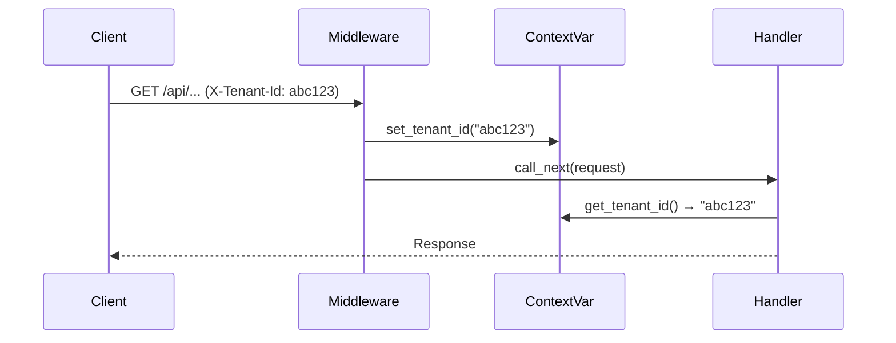
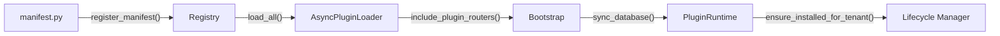
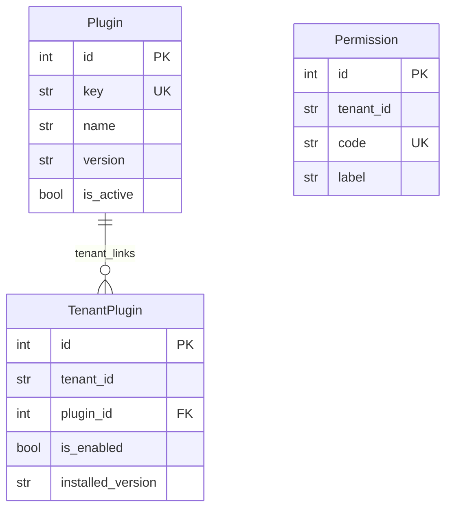
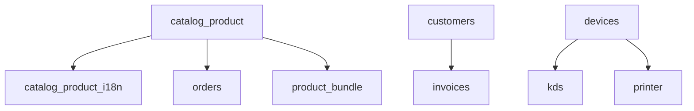

# Backend Architecture — Analyse Complète

## Vue d'ensemble

**Stack** : FastAPI (Python 3.12+) · SQLAlchemy 2.0 Async · Pydantic V2 · Alembic · aiosqlite/asyncpg

**Architecture** : **Modular Monolith** — un noyau léger (`app/core/`) + 13 plugins métier (`app/plugins/`)

```
backend/
├── app/
│   ├── main.py              ← Factory FastAPI + lifespan
│   ├── core/                ← Noyau (config, db, sécurité, tenancy, plugin system)
│   │   ├── config/settings.py
│   │   ├── db/              ← Base, session async
│   │   ├── events.py        ← EventBus (pub/sub)
│   │   ├── plugins/         ← 10 fichiers système de plugins
│   │   ├── security/        ← Auth, permissions, bcrypt
│   │   ├── tenancy/         ← Multi-tenant (middleware + context)
│   │   └── utils/
│   ├── api/                 ← 5 sous-routeurs REST
│   └── plugins/             ← 13 plugins métier
├── alembic/                 ← Migrations core
├── tests/                   ← 6 fichiers de tests
├── pyproject.toml
└── Dockerfile
```

---

## Core Modules

### 1. Configuration — [settings.py](file:///home/duke/Workspace/pos-food/backend/app/core/config/settings.py)

`Pydantic Settings` avec support `.env` :

| Variable        | Défaut                          | Description                  |
| --------------- | ------------------------------- | ---------------------------- |
| `DATABASE_URL`  | `sqlite+aiosqlite:///./data.db` | SQLite dev / PostgreSQL prod |
| `TENANT_HEADER` | `X-Tenant-Id`                   | Header HTTP multi-tenant     |
| `API_PREFIX`    | `/api`                          | Préfixe global des routes    |
| `APP_SECRET`    | `dev-secret`                    | Clé de signature             |

### 2. Base de données — [db/](file:///home/duke/Workspace/pos-food/backend/app/core/db)

- `Base` : `DeclarativeBase` SQLAlchemy 2.0
- **Mixins** : `UUIDPrimaryKeyMixin` (UUID v4 string PK), `TenantMixin` (tenant_id indexé)
- **Session** : `create_async_engine` + `async_sessionmaker` → `get_session()` dependency

### 3. Multi-Tenancy — [tenancy/](file:///home/duke/Workspace/pos-food/backend/app/core/tenancy)



- **Middleware** (`TenancyMiddleware`) : extrait `X-Tenant-Id` du header, stocke dans `ContextVar`
- **Modèle** `Tenant` : `id` (UUID), `name`, `slug`, `currency`, `locale`, `is_active`
- Fallback vers `"public"` si aucun header

### 4. Sécurité — [security/](file:///home/duke/Workspace/pos-food/backend/app/core/security)

- **Auth basique** par headers : `X-User-Id` + `X-User-Permissions`
- **Modèle** `User` : `username`, `hashed_password` (bcrypt), `full_name`, `tenant_id`, `is_superuser`
- Utilitaires : `get_password_hash()`, `verify_password()`

### 5. Event Bus — [events.py](file:///home/duke/Workspace/pos-food/backend/app/core/events.py)

Bus d'événements async `subscribe(name, handler)` / `publish(event)` avec support sync + async handlers via `asyncio.gather`.

---

## Plugin System (le cœur de l'architecture)

### Cycle de vie d'un plugin



| Fichier                                                                                          | Rôle                                                                                                            |
| ------------------------------------------------------------------------------------------------ | --------------------------------------------------------------------------------------------------------------- |
| [manifest.py](file:///home/duke/Workspace/pos-food/backend/app/core/plugins/manifest.py)         | Dataclass `PluginManifest` (key, name, version, router, requires, migrations_path, seed, permissions, ui_pages) |
| [registry.py](file:///home/duke/Workspace/pos-food/backend/app/core/plugins/registry.py)         | Stockage global + **tri topologique** (Kahn) pour résoudre les dépendances                                      |
| [loader.py](file:///home/duke/Workspace/pos-food/backend/app/core/plugins/loader.py)             | Auto-découverte : `pkgutil.iter_modules("app.plugins")` → import `manifest`                                     |
| [bootstrap.py](file:///home/duke/Workspace/pos-food/backend/app/core/plugins/bootstrap.py)       | Monte les routers à `/api/plugins/<key>` avec guard `require_plugin_enabled`                                    |
| [runtime.py](file:///home/duke/Workspace/pos-food/backend/app/core/plugins/runtime.py)           | `sync_database()` : `create_all` + upsert des lignes `Plugin`                                                   |
| [lifecycle.py](file:///home/duke/Workspace/pos-food/backend/app/core/plugins/lifecycle.py)       | Install/Upgrade **per-tenant** : Alembic migrations + seed + version tracking                                   |
| [dependencies.py](file:///home/duke/Workspace/pos-food/backend/app/core/plugins/dependencies.py) | FastAPI dependency : vérifie `TenantPlugin.is_enabled` avant chaque requête                                     |
| [guards.py](file:///home/duke/Workspace/pos-food/backend/app/core/plugins/guards.py)             | Helper `is_plugin_enabled(session, tenant_id, key) → bool`                                                      |
| [models.py](file:///home/duke/Workspace/pos-food/backend/app/core/plugins/models.py)             | 3 tables : `Plugin`, `TenantPlugin` (enable per tenant + version), `Permission`                                 |

### Modèles DB du Plugin System



---

## 13 Plugins Métier

| Plugin          | Key                    | Dépendances       | Description            |
| --------------- | ---------------------- | ----------------- | ---------------------- |
| Catalog Product | `catalog_product`      | —                 | Gestion produits       |
| Catalog i18n    | `catalog_product_i18n` | `catalog_product` | Traductions produits   |
| Orders          | `orders`               | `catalog_product` | Commandes              |
| Floor Plan      | `floor_plan`           | —                 | Plan de salle / tables |
| Customers       | `customers`            | —                 | Gestion clients        |
| Invoices        | `invoices`             | `customers`       | Facturation            |
| Devices         | `devices`              | —                 | Gestion appareils      |
| KDS             | `kds`                  | `devices`         | Kitchen Display        |
| Printer         | `printer`              | `devices`         | Impression tickets     |
| Product Bundle  | `product_bundle`       | `catalog_product` | Menus/Formules         |
| Ticket Designer | `ticket_desingner`     | —                 | Design tickets         |
| Users           | `users`                | —                 | Utilisateurs & rôles   |
| Config          | `config`               | —                 | Paramètres globaux     |

### Graphe de dépendances



---

## API Endpoints

### Core API (`/api`)

| Router            | Prefix     | Fonctions                                                  |
| ----------------- | ---------- | ---------------------------------------------------------- |
| `system`          | `/system`  | Health, info                                               |
| `setup`           | `/setup`   | `GET /status`, `GET /plugins`, `POST /`, `POST /bootstrap` |
| `plugins_runtime` | `/tenants` | CRUD plugins per-tenant (enable/disable/install/upgrade)   |
| `auth`            | `/auth`    | Authentification                                           |
| `ui`              | `/ui`      | Pages UI dynamiques                                        |

### Plugin Routers (`/api/plugins/<key>`)

Montés dynamiquement au startup via `include_plugin_routers()`. Chaque requête passe par `require_plugin_enabled(key)`.

### Setup / Bootstrap Flow

L'endpoint `/api/setup/bootstrap` fait en une seule requête :

1. Choix DB (SQLite ou PostgreSQL)
2. Écrit `DATABASE_URL` dans `.env`
3. Lance les migrations Alembic
4. Crée un tenant + admin user
5. Active les plugins sélectionnés (migrations + seed)

---

## Tests

6 fichiers dans `tests/` :

- `test_health.py` — health check
- `test_core_features.py` — fonctionnalités core
- `test_plugin_registry.py` — enregistrement et tri topo
- `test_plugins_lifecycle.py` — install/upgrade/enable/disable per-tenant (**~20KB, le plus complet**)
- `test_setup_bootstrap_utils.py` — bootstrap utils
- `conftest.py` — fixtures (async session, test client)

---

## Points d'attention

> [!WARNING]
>
> - `ticket_desingner` — typo dans le nom du dossier/key (devrait être `ticket_designer`)
> - Auth par headers (`X-User-Id`) — pas de JWT/tokens, à renforcer pour la prod

> [!NOTE]
>
> - Le backend est **prêt pour PostgreSQL** — il suffit de changer `DATABASE_URL`
> - Chaque plugin peut avoir ses propres migrations Alembic (table de version isolée `alembic_version__<key>`)
> - Le seed est **idempotent** (safe to re-run)
